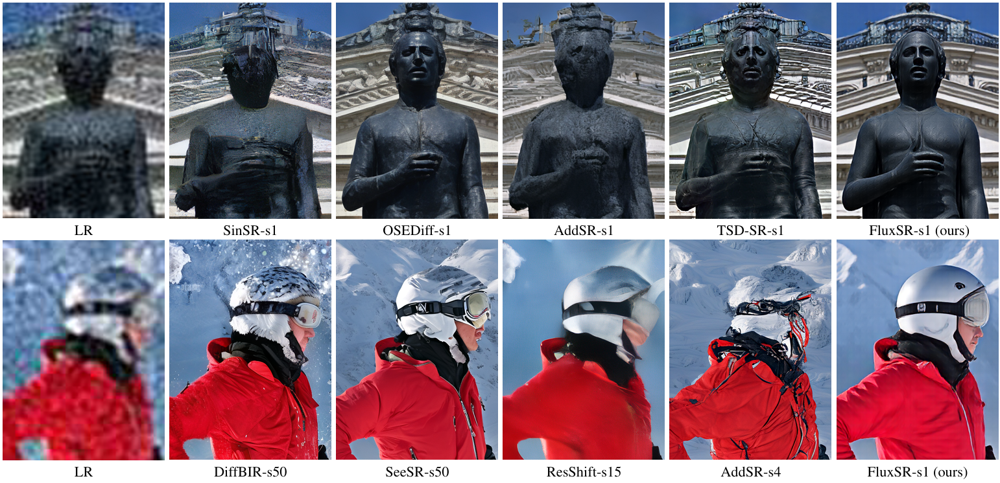
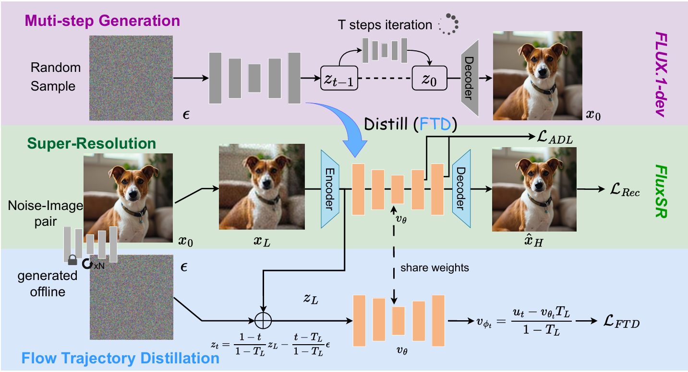
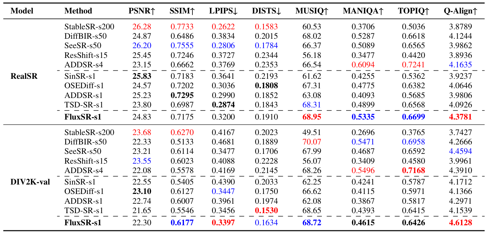
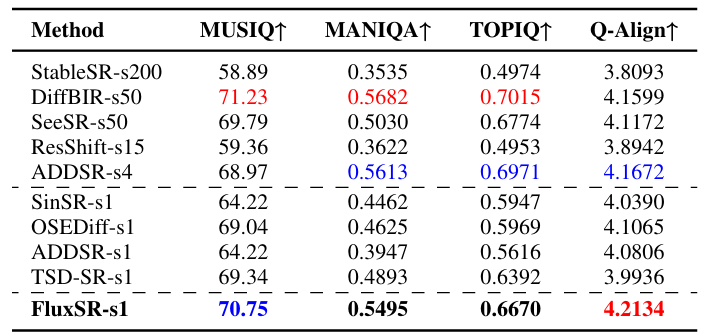
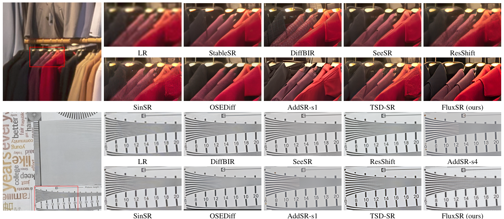

# One Diffusion Step to Real-World Super-Resolution via Flow Trajectory Distillation

[Jianze Li], [Jiezhang Cao](https://www.jiezhangcao.com/), [Yong Guo](https://www.guoyongcs.com/), [Wenbo Li](https://fenglinglwb.github.io/), and [Yulun Zhang](http://yulunzhang.com/), "One Diffusion Step to Real-World Super-Resolution via Flow Trajectory Distillation", 2025

[[project]] [[arXiv](https://arxiv.org/abs/2502.01993)] [supplementary material] [pretrained models]


#### 🔥🔥🔥 News

- **2025-02-03:** This repo is released.

---

> **Abstract:** Diffusion models (DMs) have significantly advanced the development of real-world image super-resolution (Real-ISR), but the computational cost of multi-step diffusion models limits their application. One-step diffusion models generate high-quality images in a one sampling step, greatly reducing computational overhead and inference latency. However, most existing one-step diffusion methods are constrained by the performance of the teacher model, where poor teacher performance results in image artifacts. To address this limitation, we propose FluxSR, a novel one-step diffusion Real-ISR technique based on flow matching models. We use the state-of-the-art diffusion model FLUX.1-dev as both the teacher model and the base model. First, we introduce Flow Trajectory Distillation (FTD) to distill a multi-step flow matching model into a one-step Real-ISR. Second, to improve image realism and address high-frequency artifact issues in generated images, we propose TV-LPIPS as a perceptual loss and introduce Attention Diversification Loss (ADL) as a regularization term to reduce token similarity in transformer, thereby eliminating high-frequency artifacts. Comprehensive experiments demonstrate that our method outperforms existing one-step diffusion-based Real-ISR methods.



---

### Pipeline



---

## 🔖 TODO

- [ ] Release testing code and pre-trained models.
- [ ] Release training code. 
- [ ] Release pre-trained models.
- [ ] Provide HuggingFace demo.

## 🔗 Contents

1. Models
1. Training
1. Testing
1. [Results](#results)
1. [Citation](#citation)
1. [Acknowledgements](#acknowledgements)

## <a name="results"></a>🔎 Results

We achieve impressive performance on GIQA-DES and GIQA-VQA tasks.

<details>
<summary>Quantitative Results (click to expand)</summary>

- Results in Table 1 of the main paper

<p align="center">
  
</p>

- Results in Table 2 (RealSet65 testset) of the main paper

<p align="center">
  
</p>
</details>


<details>
<summary>Qualitative Results (click to expand)</summary>

- Results in Figure 5 of the main paper

<p align="center">
  
</p>


</details>

## <a name="citation"></a>📎 Citation

If you find the code helpful in your research or work, please cite the following paper(s).

```
@article{li2025one,
  title={One Diffusion Step to Real-World Super-Resolution via Flow Trajectory Distillation},
  author={Li, Jianze and Cao, Jiezhang and Guo, Yong and Li, Wenbo and Zhang*, Yulun},
  journal={arXiv preprint arXiv:2502.01993},
  year={2025}
}
```

## <a name="acknowledgements"></a>💡 Acknowledgements

This project is based on [FLUX](https://github.com/black-forest-labs/flux).
